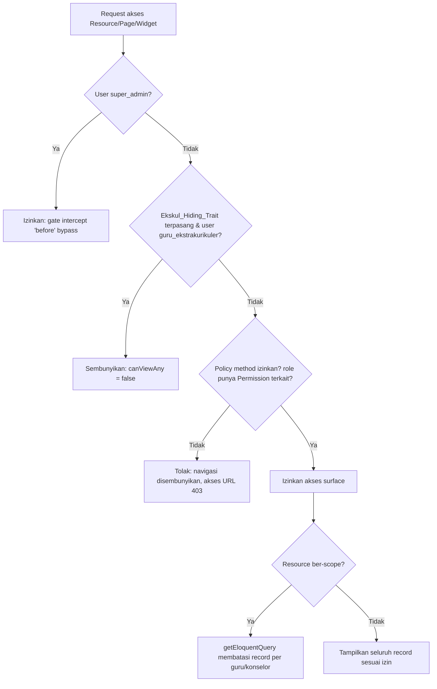
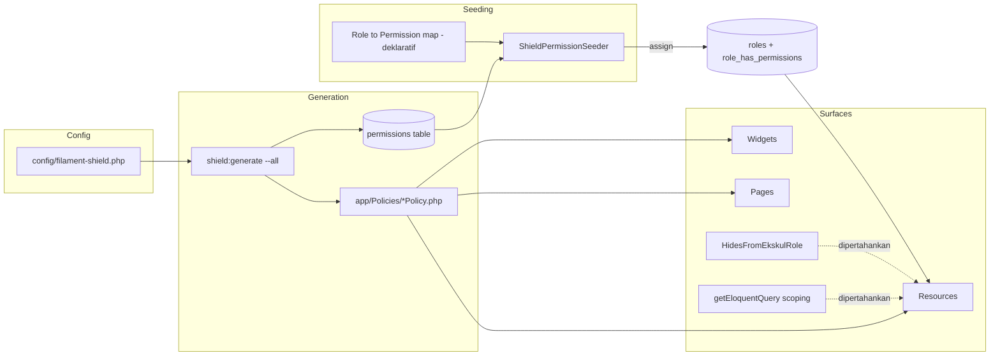
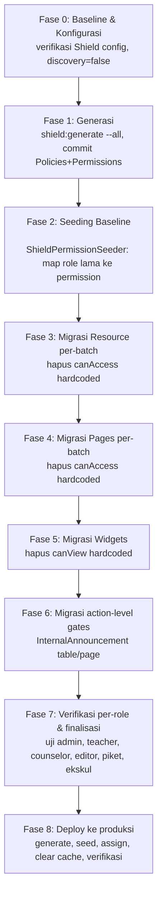
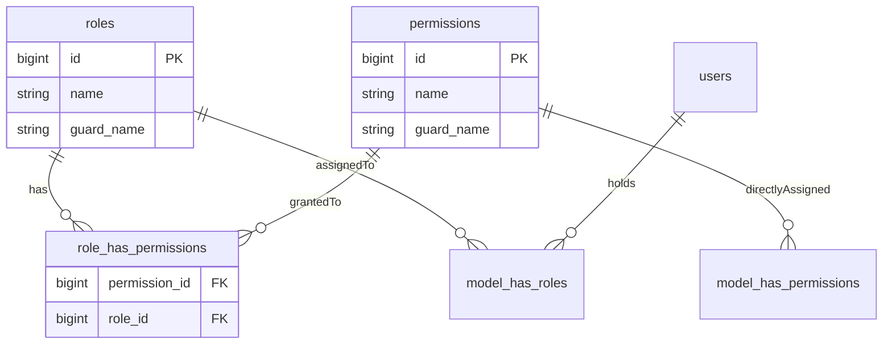

# Design Document

## Overview

Dokumen ini merancang migrasi kontrol akses panel admin (`/admin`) dari pendekatan berbasis ROLE yang di-hardcode menjadi pendekatan MURNI berbasis PERMISSION menggunakan Filament Shield (`bezhansalleh/filament-shield ^4.2`) di atas Spatie Laravel Permission (`^7.4`), pada Filament `4.0` / Laravel `^12.0`.

Saat ini otorisasi tersebar di banyak titik dan menimpa logika Shield:

- **28 method `canAccess()`** pada Resource dan Page yang memanggil `hasAnyRole([...])`.
- **1 Widget** (`LessonProgressWidget`) dengan `canView()` berbasis `hasAnyRole()`.
- **~50 Resource** memakai trait `HidesFromEkskulRole` yang meng-override `canViewAny()` untuk menyembunyikan menu dari role `guru_ekstrakurikuler`.
- **8 Resource** memakai `getEloquentQuery()` untuk Data_Scoping per-guru/konselor (Quiz, QuestionBank, ParentNote, LessonSession, CurriculumPlan, CounselingTicket, ClassAssignment, InternalAnnouncement).
- Beberapa action-level gate (`->visible(fn () => ... hasAnyRole())`) pada tabel/halaman InternalAnnouncement.

Tujuan akhir: setiap akses ke Resource, Page, dan Widget pada Admin_Panel sepenuhnya dikontrol oleh permission yang di-assign ke role melalui halaman Shield Role Management (`/admin/shield/roles/{id}/edit`), bukan oleh role hardcoded.

Karena perubahan ini berisiko mengunci akses user produksi, strategi inti desain ini adalah **migrasi incremental yang aman**: men-generate seluruh permission lebih dulu, men-seed baseline permission agar role yang ada tidak kehilangan akses, lalu menghapus Manual_Access_Method secara bertahap per-entitas. Selama transisi, entitas yang sudah dimigrasi dikontrol oleh Shield, sementara entitas yang belum dimigrasi tetap berperilaku lama. Data_Scoping dan perilaku penyembunyian ekskul dipertahankan secara independen dari permission.

Panel Tahfidz (`/tahfidz`), portal siswa (`/portal`), dan portal orang tua (`/portal/ortu`) berada DI LUAR scope dan dilindungi oleh batasan discovery Shield (`discover_all_* = false`).

### Design Goals

1. **No lockout**: Pada setiap tahap, Super_Admin dan role yang sudah di-seed tetap dapat mengakses panel sesuai perilaku sebelum migrasi.
2. **Single source of truth**: Mapping role→permission terdokumentasi dalam kode (Permission_Seeder) dan dapat di-override via UI Shield.
3. **Incremental & reversible**: Setiap Resource/Page/Widget dapat dimigrasi dan diverifikasi satu per satu tanpa merusak entitas lain.
4. **Separation of concerns**: Permission (siapa boleh melihat surface) terpisah dari Data_Scoping (record mana yang terlihat) dan dari Ekskul_Hiding (penyembunyian menu khusus ekskul).

### Key Design Decisions

| Keputusan | Pilihan | Rasional |
|-----------|---------|----------|
| Mekanisme Super_Admin | Gate intercept `before` (`super_admin.enabled = true`, `intercept_gate = before`) | Sudah dikonfigurasi; memberi bypass otorisasi tanpa perlu assign permission eksplisit, menjamin jalur akses administratif tak terkunci. |
| Idempotensi seeder | Full replacement via `syncPermissions()` per role yang dikelola | Hasil deterministik tanpa duplikasi; menjalankan ulang menghasilkan state identik. |
| Permission tak ditemukan | Fail-fast pada permission pertama yang hilang | Mencegah seeding parsial yang menyesatkan; memaksa urutan `shield:generate` sebelum seeder. |
| Penyembunyian ekskul | Pertahankan trait + jangan assign permission ke `guru_ekstrakurikuler` | Trait dan ketiadaan permission saling memperkuat; trait tetap aman karena memanggil `parent::canViewAny()`. |
| Data_Scoping | Tetap di `getEloquentQuery()`, lepas dari permission | Scoping adalah pembatasan record, bukan otorisasi surface; harus bertahan setelah `canAccess()` dihapus. |
| Urutan migrasi | Generate → seed → hapus `canAccess()` per-entitas | Permission harus eksis dan ter-assign sebelum gate hardcoded dilepas, agar tak ada lockout. |

## Architecture

### Authorization Flow (Target State)

Setelah migrasi, keputusan akses untuk sebuah surface mengikuti alur berikut:



Poin penting:

- **Gate intercept** dijalankan paling awal untuk Super_Admin (Spatie `Gate::before` melalui Shield), sehingga seluruh pengecekan langsung lolos.
- **Ekskul_Hiding_Trait** beroperasi pada lapisan `canViewAny()` (registrasi navigasi & viewAny). Karena trait memanggil `parent::canViewAny()`, setelah `canAccess()` hardcoded dihapus, `parent::canViewAny()` akan mengalir ke Policy Shield. Trait hanya menambahkan kondisi "false untuk ekskul" di atasnya.
- **Policy Shield** memetakan aksi (`viewAny`, `view`, `create`, ...) ke pengecekan `$user->can('Prefix:Subject')`.
- **Data_Scoping** dijalankan setelah otorisasi surface lolos, murni di lapisan query.

### Component Layers



### Incremental Migration Strategy

Migrasi disusun menjadi fase yang masing-masing meninggalkan panel dalam kondisi usable (Req 10).



Invarian transisi (berlaku di antara fase):

- Entitas yang **belum** dimigrasi tetap punya `canAccess()` lama → berperilaku seperti sebelum migrasi (Req 4.3, 10.3).
- Entitas yang **sudah** dimigrasi dikontrol Shield; karena Fase 2 sudah men-seed permission setara akses lama, role yang ada tidak kehilangan akses (Req 3.1, 10.2).
- Penghapusan `canAccess()` (Fase 3+) TIDAK boleh dimulai sebelum Fase 2 selesai di environment terkait (Req 12.3).

### Out-of-Scope Protection

`config/filament-shield.php` `discovery` di-set `discover_all_resources/widgets/pages = false`. Shield hanya menemukan entitas pada panel default (`admin`). Entitas eksklusif panel Tahfidz tidak ter-generate permission-nya, dan kontrol akses Tahfidz/portal tetap pada `canAccessPanel()` di `User` model serta middleware masing-masing panel (Req 9.1, 9.3).

## Components and Interfaces

### 1. Shield Configuration (`config/filament-shield.php`)

Konfigurasi yang sudah ada dipertahankan dan diverifikasi:

- `super_admin`: `enabled = true`, `name = super_admin`, `intercept_gate = before` (Req 2.1, 2.2).
- `permissions`: `separator = ':'`, `case = pascal`, `generate = true` (Req 1.4) → menghasilkan nama seperti `ViewAny:Quiz`, `View:Quiz`, `Update:Quiz`, `View:JurnalMengajar`.
- `policies`: `path = app_path('Policies')`, `generate = true`, methods lengkap (`viewAny, view, create, update, delete, deleteAny, restore, forceDelete, ...`) (Req 1.1, 1.5).
- `pages`: `prefix = view`, exclude `Dashboard::class` (Req 1.3, 5.2).
- `widgets`: `prefix = view`, exclude `AccountWidget`, `FilamentInfoWidget` (Req 1.3, 6.2).
- `discovery`: seluruhnya `false` (Req 9.3).

Tidak ada perubahan struktural wajib pada config; bila ada entitas yang tidak boleh punya permission, ditambahkan ke array `exclude` masing-masing (Req 1.3).

### 2. Shield_Generator (`php artisan shield:generate --all`)

Antarmuka CLI bawaan Shield. Tanggung jawab:

- Membuat Policy untuk setiap Resource ke `app/Policies` (membuat direktori bila belum ada) (Req 1.1, 1.5).
- Membuat Permission untuk setiap Resource/Page/Widget non-excluded ke tabel `permissions` Spatie dengan format pascal + separator `:` (Req 1.2, 1.4).
- Melewati entitas pada daftar exclude (Req 1.3).

Karena ini perintah pihak ketiga, hasilnya divalidasi via **snapshot/integration check** (lihat Testing Strategy), bukan PBT.

### 3. ShieldPermissionSeeder (komponen baru)

Seeder Laravel baru di `database/seeders/ShieldPermissionSeeder.php`. Antarmuka logis:

```php
final class ShieldPermissionSeeder extends Seeder
{
    /**
     * Peta deklaratif Role -> daftar nama Permission (selain super_admin).
     * Mendokumentasikan akses baseline setiap role pasca-migrasi.
     *
     * @return array<string, list<string>>
     */
    public static function map(): array;

    /**
     * Terapkan map: untuk tiap role yang dikelola, sinkronkan
     * (full replacement) permission-nya. Fail-fast bila ada nama
     * permission yang tidak ditemukan di database.
     */
    public function run(): void;
}
```

Perilaku kunci:

- **Deklaratif** (Req 3.2): `map()` mengembalikan array konstan role→permission, sehingga mapping terbaca di kode.
- **Idempoten via full replacement** (Req 3.3): untuk tiap role yang dikelola, gunakan `$role->syncPermissions($names)` sehingga hasil akhir = himpunan yang dideklarasikan, tanpa duplikasi, identik pada eksekusi berulang.
- **Fail-fast** (Req 3.4): sebelum assign, setiap nama permission diverifikasi keberadaannya; pada permission pertama yang tidak ditemukan, seeder melempar exception yang memuat nama permission tersebut dan berhenti.
- **Tidak menyentuh role di luar map** (Req 3.5, 5/preservation): hanya role yang ada di `map()` yang disinkronkan; role lain (mis. `student`, `parent`, role yang dikelola manual) tidak diubah.
- **Tidak meng-assign Super_Admin** (Req 3.1): `super_admin` sengaja diabaikan karena memperoleh akses via gate intercept.
- **Ekskul exclusion** (Req 7.2): map untuk `guru_ekstrakurikuler` TIDAK memuat permission untuk Resource yang sebelumnya disembunyikan dari role tersebut.

Mapping baseline diturunkan langsung dari `canAccess()` lama. Contoh derivasi (ringkas):

| Role | Sumber akses lama | Contoh permission baseline |
|------|-------------------|----------------------------|
| `admin` | mayoritas `hasAnyRole([...,'admin',...])` | seluruh permission Resource/Page/Widget non-ekskul-only |
| `teacher` | `canAccess` memuat `teacher` (Quiz, QuestionBank, LessonSession, Grade, ParentNote, dll.) | `ViewAny/Create/Update/...` untuk Resource akademik + Page guru (JurnalMengajar, InputNilai*, Laporan*) |
| `counselor` | `StudentViolation`, `CounselingTicket` | permission untuk dua Resource tersebut |
| `editor` | `ClassMaterial`, `ClassAnnouncement`, `ClassAssignment`, `InternalAnnouncement` (editor) | permission konten terkait |
| `piket` | `AbsensiHariIni` page | `View:AbsensiHariIni` (+ Resource pendukung bila ada) |
| `guru_ekstrakurikuler` | hanya surface yang tidak disembunyikan trait | hanya permission Resource/Page yang relevan ekskul (mis. Extracurricular*) |

### 4. Surface Migrations

#### 4a. Resources (Req 4)

Untuk tiap Resource yang dimigrasi: hapus method `canAccess()` berbasis `hasAnyRole()`. Visibilitas/akses lalu ditentukan Policy Shield via permission `viewAny`. Jika user tak punya `ViewAny:{Subject}`, navigasi tersembunyi dan akses URL ditolak 403 (Req 4.2, 4.4).

#### 4b. Pages (Req 5)

Untuk tiap custom Page yang dimigrasi: hapus `canAccess()` hardcoded. Akses Page dikontrol permission `View:{Page}`. Tanpa permission → navigasi tersembunyi (Req 5.4) dan akses langsung menghasilkan HTTP 403, bukan 200 (Req 5.3).

#### 4c. Widgets (Req 6)

`LessonProgressWidget::canView()` hardcoded dihapus; visibilitas ditentukan `View:{Widget}`. Tanpa permission, konten widget tidak dirender, namun widget boleh tetap muncul sebagai placeholder/nonaktif pada layout (Req 6.3).

#### 4d. Action-level gates

Gate `->visible(fn () => hasAnyRole())` pada InternalAnnouncement (table & pages) dipertimbangkan untuk diselaraskan dengan permission granular (`Update:`, `Delete:`) bila tersedia. Ini bersifat penyempurnaan dan tidak boleh menyebabkan lockout.

### 5. Ekskul_Hiding_Trait (`HidesFromEkskulRole`) (Req 7)

Trait tetap dipertahankan tanpa perubahan logika:

```php
public static function canViewAny(): bool
{
    if (auth()->user()?->hasRole('guru_ekstrakurikuler')) {
        return false;
    }
    return parent::canViewAny();
}
```

Setelah `canAccess()` hardcoded dihapus, `parent::canViewAny()` mengalir ke Policy Shield. Trait hanya menambahkan kondisi penyembunyian untuk `guru_ekstrakurikuler`, dan tetap aman/tanpa error apa pun status migrasi Resource (Req 7.3, 7.4). Penyembunyian akhir untuk ekskul dijamin oleh dua lapis: trait + ketiadaan permission pada role tersebut (Req 7.1, 7.2).

### 6. Data_Scoping (`getEloquentQuery()`) (Req 8)

Override `getEloquentQuery()` pada 8 Resource ber-scope DIPERTAHANKAN. Scoping membatasi record berdasarkan kepemilikan/penugasan (mis. `where('staff_member_id', $user->staffMember?->id)`), terpisah dari pengecekan permission. Setelah Resource dimigrasi, scoping tetap berlaku independen dari Shield (Req 8.1, 8.3). Untuk role `teacher`/`counselor` non-admin, record dibatasi pada miliknya (Req 8.2).

## Data Models

Tidak ada tabel domain baru. Migrasi memanfaatkan skema Spatie Permission yang sudah ada.

### Spatie Permission Tables (eksisting)



### Permission Naming Model

Permission dihasilkan Shield dengan format `{Prefix}{Separator}{Subject}` (case pascal, separator `:`):

- Resource: `ViewAny:Quiz`, `View:Quiz`, `Create:Quiz`, `Update:Quiz`, `Delete:Quiz`, `DeleteAny:Quiz`, dst.
- Page: `View:JurnalMengajar`, `View:AbsensiHariIni`, dst.
- Widget: `View:LessonProgressWidget`, dst.

### Role→Permission Mapping Model (konseptual)

`ShieldPermissionSeeder::map()` adalah fungsi murni yang memetakan nama role ke himpunan nama permission:

```
map : RoleName -> Set<PermissionName>
```

Properti yang diharapkan dari struktur ini (lihat Correctness Properties):

- `super_admin` ∉ domain(map) — tidak pernah di-seed.
- `guru_ekstrakurikuler` → himpunan yang TIDAK memuat permission Resource yang disembunyikan trait.
- Untuk role apa pun di domain(map), hasil seeding = `map(role)` persis (full replacement).

### Existing Roles (referensi)

`super_admin`, `admin`, `teacher`, `counselor`, `editor`, `piket`, `guru_ekstrakurikuler`, `panel_user`, `student`, `parent` (plus `contributor`, `wali_kelas`, `guru_pengampuh` dari RoleSeeder). Hanya role pengguna Admin_Panel non-super yang masuk ke `map()`.

## Correctness Properties

*A property is a characteristic or behavior that should hold true across all valid executions of a system — essentially, a formal statement about what the system should do. Properties serve as the bridge between human-readable specifications and machine-verifiable correctness guarantees.*

Catatan ruang lingkup PBT: sebagian besar kriteria pada fitur ini bersifat **konfigurasi/integrasi dengan tool pihak ketiga** (menjalankan `shield:generate`, perilaku gate Shield, kontrak HTTP 403, prosedur deployment). Kriteria tersebut diuji dengan integration/smoke/example test, BUKAN PBT (lihat Testing Strategy). Property di bawah ini hanya mencakup bagian yang merupakan **logika kode kita sendiri** dengan perilaku yang bervariasi terhadap input: aturan akses-iff-permission, logika `ShieldPermissionSeeder`, invarian penyembunyian ekskul, dan logika Data_Scoping.

Reasoning ringkas (dari prework): aturan akses-iff-permission muncul di 4.2, 4.4, 5.2, 5.4, 6.2, 7.1, dan 11.1 — semuanya direduksi menjadi satu Property komprehensif (Property 1). Cabang spesifik HTTP 403 / penyembunyian navigasi (5.3, 5.4, 6.3, 11.2) menjadi example/integration test. Property seeder (3.1, 3.3, 3.4, 3.5) masing-masing memberi nilai validasi unik. Invarian ekskul (7.2, 7.4) dan scoping (8.2 yang menyerap 8.3) dipertahankan terpisah.

### Property 1: Surface access if and only if permission

*For any* non-super user, any migrated Resource/Page/Widget, and any subset of permissions assigned to that user's role, the Admin_Panel SHALL grant access to that surface **if and only if** the role holds the permission corresponding to that surface (`ViewAny:{Subject}` untuk Resource, `View:{Page}`/`View:{Widget}` untuk Page/Widget). Akibatnya, navigasi tampil hanya jika akses diizinkan dan akses ditolak ketika permission tidak ada.

**Validates: Requirements 4.2, 4.4, 5.2, 5.4, 6.2, 7.1, 11.1**

### Property 2: Seeder assigns exactly the declared map and never touches Super_Admin

*For any* declarative role→permission map (dengan seluruh permission yang direferensikan sudah ada di database), setelah `ShieldPermissionSeeder::run()` dijalankan, setiap role yang dikelola SHALL memiliki himpunan permission yang persis sama dengan `map(role)` (tanpa duplikasi), dan role `super_admin` SHALL tidak menerima assignment apa pun dari seeder.

**Validates: Requirements 3.1, 3.2**

### Property 3: Seeder idempotence under repetition

*For any* declarative map dan kondisi assignment awal apa pun, menjalankan `ShieldPermissionSeeder::run()` dua kali SHALL menghasilkan kondisi assignment untuk role yang dikelola yang identik dengan menjalankannya sekali (full replacement → `run(); run()` ≡ `run()`).

**Validates: Requirements 3.3**

### Property 4: Seeder preserves assignments of unmanaged roles

*For any* role yang TIDAK ada dalam map yang dikelola seeder, dan assignment permission awal apa pun pada role tersebut, setelah `ShieldPermissionSeeder::run()` dijalankan, himpunan permission role tersebut SHALL tidak berubah.

**Validates: Requirements 3.5**

### Property 5: Seeder fails fast on the first missing permission

*For any* map yang memuat setidaknya satu nama permission yang tidak ada di database, `ShieldPermissionSeeder::run()` SHALL berhenti pada permission pertama yang tidak ditemukan dan melaporkan kesalahan yang memuat nama permission tersebut, tanpa menyelesaikan assignment berikutnya.

**Validates: Requirements 3.4**

### Property 6: Ekskul role map excludes hidden-resource permissions

*For any* permission yang berkaitan dengan Resource yang sebelumnya disembunyikan dari `guru_ekstrakurikuler`, permission tersebut SHALL tidak termasuk dalam `map('guru_ekstrakurikuler')` (irisan antara himpunan permission resource-tersembunyi dengan map ekskul adalah kosong).

**Validates: Requirements 7.2**

### Property 7: Trait-bearing resources always hide guru_ekstrakurikuler

*For any* Resource yang memakai `HidesFromEkskulRole` dan *for any* user dengan role `guru_ekstrakurikuler` (dengan himpunan permission apa pun), `canViewAny()` Resource tersebut SHALL mengembalikan `false`, terlepas dari status migrasi Resource maupun permission yang dimiliki user.

**Validates: Requirements 7.3, 7.4**

### Property 8: Scoped query returns exactly the teacher's own records, independent of permissions

*For any* kumpulan record dengan kepemilikan (`staff_member_id` / penugasan) yang beragam, dan user dengan role `teacher` (bukan `super_admin`/`admin`) dengan himpunan permission apa pun, `getEloquentQuery()` pada Resource ber-scope SHALL mengembalikan tepat record yang terkait dengan guru tersebut sesuai aturan scoping Resource, dan hasil ini SHALL tidak berubah ketika himpunan permission user divariasikan.

**Validates: Requirements 8.1, 8.2, 8.3**

## Error Handling

| Kondisi | Penanganan | Requirement |
|---------|-----------|-------------|
| Generasi gagal sebagian | Shield menyimpan permission yang berhasil, mencatat entitas gagal ke log, tidak membatalkan seluruh proses. Setelah generate, dijalankan langkah verifikasi yang membandingkan daftar entitas panel dengan permission yang terbentuk. | 1.6 |
| Direktori `app/Policies` belum ada | Shield_Generator membuat direktori sebelum menulis Policy. | 1.5 |
| Permission yang direferensikan seeder tidak ada | `ShieldPermissionSeeder` fail-fast: lempar exception berisi nama permission pertama yang hilang; tidak melakukan assignment parsial lanjutan. Mendorong urutan benar (generate sebelum seed). | 3.4 |
| User tanpa permission mengakses Resource/Page/Widget migrasi via URL | Policy menolak; Filament/Laravel mengembalikan HTTP 403; entitas tidak muncul di navigasi. | 4.4, 5.3, 11.2 |
| Widget tanpa permission | Konten tidak dirender; widget boleh tetap sebagai placeholder/nonaktif tanpa membocorkan data. | 6.3 |
| Kesalahan otorisasi saat migrasi bertahap | Sediakan pesan/diagnostik yang membedakan "entitas belum dimigrasi" dari "permission benar-benar tidak dimiliki", agar tidak salah diagnosis. | 10.4 |
| Cache permission basi setelah assignment | Jalankan pembersihan cache permission Spatie (`php artisan permission:cache-reset`) dan cache aplikasi; permintaan berikutnya memakai assignment terbaru. | 12.2 |
| Risiko lockout produksi | Jika Permission_Seeder belum dijalankan di environment, tahan penghapusan Manual_Access_Method (gating prosedural di runbook). | 12.3 |

## Testing Strategy

Pendekatan pengujian bersifat **dual** dan disesuaikan dengan sifat tiap kriteria. Karena fitur ini menggabungkan logika kode sendiri (seeder, scoping, aturan akses) dengan integrasi tool pihak ketiga (Shield generation, gate, HTTP), sebagian kriteria memakai PBT dan sebagian memakai integration/smoke/example test.

### Property-Based Tests (logika kode sendiri)

Library: **Pest v3 + `pestphp/pest-plugin-faker`** atau **`pestphp/pest`** dengan generator kustom, dijalankan via PHPUnit di atas database test (SQLite in-memory) menggunakan `RefreshDatabase`. Bila diinginkan generator yang lebih kaya, gunakan pendekatan iteratif berbasis `faker` di dalam loop minimal 100 iterasi per property.

Aturan:
- Setiap property test menjalankan **minimal 100 iterasi** (randomisasi input).
- Setiap test diberi tag komentar yang mereferensikan property desain.
- Tag format: **Feature: permission-based-access-control, Property {number}: {property_text}**
- Satu property diimplementasikan oleh SATU property-based test.

Pemetaan property → fokus generator:

| Property | Generator | Oracle |
|----------|-----------|--------|
| P1 Surface access iff permission | role + subset permission acak; surface acak dari daftar migrasi | `Gate`/`Resource::canAccess()`/`canViewAny()` == (permission ∈ subset) |
| P2 Seeder assigns exactly map | map acak (role→set permission) dengan permission pre-created | `role->permissions` == `map(role)`; `super_admin` kosong dari seeder |
| P3 Idempotence | map acak + state awal acak | snapshot setelah 1x == setelah 2x |
| P4 Preserve unmanaged roles | role unmanaged + pre-assignment acak | assignment tak berubah |
| P5 Fail-fast missing permission | map dengan ≥1 permission tak ada (posisi acak) | exception dilempar, pesan memuat nama permission hilang |
| P6 Ekskul map exclusion | himpunan permission resource-tersembunyi | irisan dengan `map('guru_ekstrakurikuler')` kosong |
| P7 Trait hides ekskul | user ekskul + permission acak; resource trait-bearing acak | `canViewAny()` == false |
| P8 Scoping correctness | record dengan owner acak + permission user acak | query == record milik guru; invarian terhadap variasi permission |

### Example / Unit Tests

- Req 2.3: `super_admin` boleh, role non-super tanpa permission ditolak pada Shield Role Management.
- Req 5.3 / 6.3 / 11.2: HTTP test — tanpa permission → 403; dengan permission → 200; widget content absen tanpa permission.
- Req 7.3: komposisi trait + Shield tidak melempar error; ekskul → tersembunyi, non-ekskul berpermission → tampil.
- Req 10.4: jalur pesan diagnostik (jika diimplementasikan).
- Req 11.3: test diparametrisasi minimal untuk role `admin`, `teacher`, `counselor`, `editor`, `piket`, `guru_ekstrakurikuler`.

### Integration Tests (tool pihak ketiga & wiring)

- Req 1.1, 1.2, 1.4: setelah `shield:generate --all`, assert Policy file untuk sample Resource ada, dan permission untuk sample entity tergenerate dengan format penamaan benar.
- Req 4.3, 10.2, 10.3: panel dalam kondisi migrasi campuran dapat dimuat tanpa error otorisasi.
- Req 9.1, 9.2: Tahfidz/portal tetap dapat diakses user berwenang pasca-tiap tahap.
- Req 11.4 / 2.1: `super_admin` diizinkan pada seluruh sample surface migrasi (gate intercept).
- Req 12.2: ubah assignment → clear cache → `can()` mencerminkan perubahan.

### Smoke / Config Tests (setup sekali jalan)

- Req 1.3, 9.3: tidak ada permission untuk entitas excluded (Dashboard, AccountWidget, FilamentInfoWidget) maupun entitas Tahfidz-only.
- Req 1.5: direktori `app/Policies` dibuat bila belum ada.
- Req 2.2: nilai config `intercept_gate = before` dan `Gate::before` short-circuit untuk `super_admin`.
- Req 4.1, 5.1, 6.1, 8.1: pemeriksaan statik bahwa entitas yang dimigrasi tidak lagi memuat `canAccess()`/`canView()` berbasis `hasAnyRole()`, dan `getEloquentQuery()` scoping tetap ada.
- Req 10.1, 10.5, 12.1, 12.3, 12.4: keberadaan runbook deployment berurutan + perintah/checklist verifikasi per-tahap dan pasca-deploy.

### Per-Stage Verification (Req 10.5)

Setiap tahap migrasi diakhiri dengan verifikasi: jalankan suite test relevan, lalu login manual minimal sebagai `super_admin` dan satu role non-super yang sudah di-seed untuk memastikan akses sesuai permission sebelum lanjut ke tahap berikutnya.

### Deployment Procedure (Req 12)

Urutan langkah produksi:

1. `php artisan shield:generate --all` (Req 12.1, 1.x).
2. `php artisan db:seed --class=ShieldPermissionSeeder` (Req 12.1, 3.x).
3. Lakukan Permission_Assignment tambahan/penyesuaian via Shield Role Management bila perlu (Req 12.1).
4. `php artisan permission:cache-reset` lalu bersihkan cache aplikasi (`config:clear`/`cache:clear`) (Req 12.1, 12.2).
5. Verifikasi pasca-deploy: pastikan `super_admin` dan minimal satu role non-super dapat mengakses Admin_Panel sesuai permission (Req 12.4).

Gating: jangan men-deploy penghapusan Manual_Access_Method ke environment yang belum menjalankan langkah 1–2 (Req 12.3).
